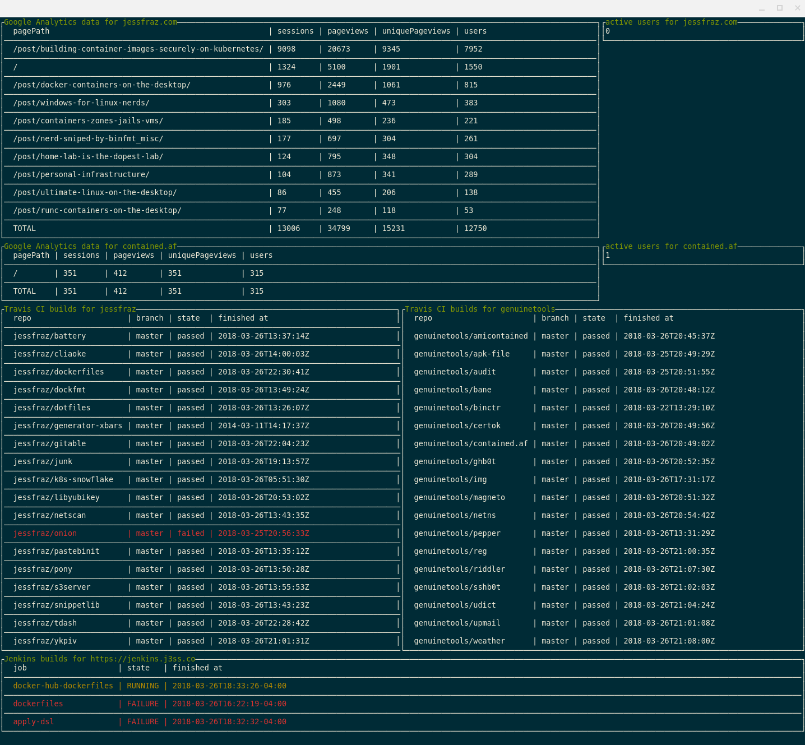

# tdash

[](https://travis-ci.org/jessfraz/tdash)

A terminal dashboard with stats from Google Analytics, GitHub, Travis CI, and Jenkins. Very much built specific to me.



## Installation

#### Binaries

- **darwin** [386](https://github.com/jessfraz/tdash/releases/download/v0.5.1/tdash-darwin-386) / [amd64](https://github.com/jessfraz/tdash/releases/download/v0.5.1/tdash-darwin-amd64)
- **freebsd** [386](https://github.com/jessfraz/tdash/releases/download/v0.5.1/tdash-freebsd-386) / [amd64](https://github.com/jessfraz/tdash/releases/download/v0.5.1/tdash-freebsd-amd64)
- **linux** [386](https://github.com/jessfraz/tdash/releases/download/v0.5.1/tdash-linux-386) / [amd64](https://github.com/jessfraz/tdash/releases/download/v0.5.1/tdash-linux-amd64) / [arm](https://github.com/jessfraz/tdash/releases/download/v0.5.1/tdash-linux-arm) / [arm64](https://github.com/jessfraz/tdash/releases/download/v0.5.1/tdash-linux-arm64)
- **windows** [386](https://github.com/jessfraz/tdash/releases/download/v0.5.1/tdash-windows-386) / [amd64](https://github.com/jessfraz/tdash/releases/download/v0.5.1/tdash-windows-amd64)

#### Via Go

```bash
$ go get github.com/jessfraz/tdash
```

#### Running with Docker

```console
$ docker run --rm -it \
    --name tdash \
    --volume /home/user/.tdash:/root/.tdash:ro \ # for the  Google Analytics key file
    r.j3ss.co/tdash
```

## Usage

```conosle
$ tdash -h
     _           _
  __| | __ _ ___| |__
 / _` |/ _` / __| '_ \
| (_| | (_| \__ \ | | |
 \__,_|\__,_|___/_| |_|


 A terminal dashboard with stats from
 Google Analytics, GitHub, Travis CI, and Jenkins.
 Version: v0.5.1
 Build: 338723b

  -all
        Show all builds even successful ones, defaults to only showing failures
  -d    run in debug mode
  -ga-keyfile string
        Path to Google Analytics keyfile (default "/home/jessie/.tdash/ga.json")
  -ga-viewid value
        Google Analytics view IDs (can have more than one)
  -interval string
        update interval (ex. 5ms, 10s, 1m, 3h) (default "2m")
  -jenkins-password string
        Jenkins password for authentication (or env var JENKINS_PASSWORD)
  -jenkins-uri string
        Jenkins base URI (or env var JENKINS_BASE_URI)
  -jenkins-username string
        Jenkins username for authentication (or env var JENKINS_USERNAME)
  -travis-owner value
        Travis owner name for builds (can have more than one)
  -travis-token string
        Travis CI API token (or env var TRAVISCI_API_TOKEN)
  -v    print version and exit (shorthand)
  -version
        print version and exit
```

## Setup

### Google Analytics

1. Enable the API: To get started using Analytics Reporting API v4, you need to 
    first create a project in the 
    [Google API Console](https://console.developers.google.com),
    enable the API, and create credentials.

    Follow the instructions 
    [for step enabling the API here](https://developers.google.com/anaytics/devguides/reporting/core/v4/quickstart/service-java).

2. Add the new service account to the Google Analytics account with 
    [Read & Analyze](https://support.google.com/analytics/answer/2884495) 
    permission.

    The newly created service account will have an email address that looks
    similar to: `quickstart@PROJECT-ID.iam.gserviceaccount.com`.

    Use this email address to 
    [add a user](https://support.google.com/analytics/answer/1009702) to the 
    Google Analytics view you want to access via the API. 

### Travis

1. Get your Travis token: Go to the "Profile" tab on your 
	[Accounts page](https://travis-ci.org/profile)
